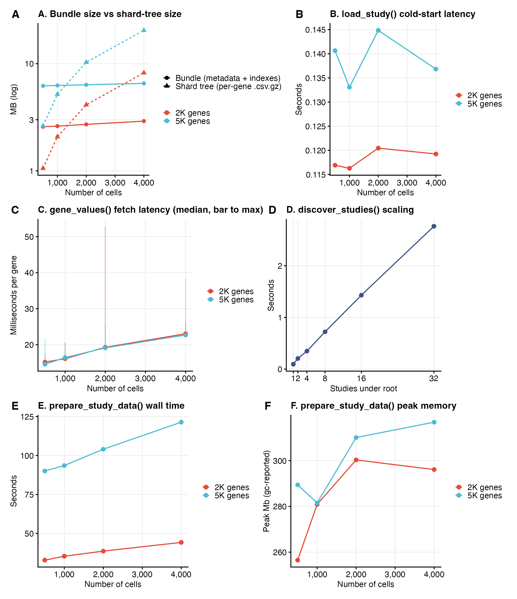

---
# Pandoc reads these on `--pdf-engine=xelatex` builds and threads them
# into the LaTeX template. Widen margins to 0.6 in -> 7.3 in text block
# (default would be 6.5 in). Also tighten line spacing slightly.
geometry:
  - paperwidth=8.5in
  - paperheight=11in
  - left=0.6in
  - right=0.6in
  - top=0.8in
  - bottom=0.8in
fontsize: 11pt
linestretch: 1.15
mainfont: Helvetica
monofont: Menlo
linkcolor: NavyBlue
urlcolor:  NavyBlue
header-includes:
  - \usepackage{microtype}
---

# scMINER Viewer: an offline, multi-study browser for single-cell mutual-information networks

*Honglei Zhou¹*, *Jiyang Yu*¹\*

¹ Department of Computational Biology, St. Jude Children's Research Hospital, Memphis, TN 38105, USA.

\* To whom correspondence should be addressed.


---

## Abstract

**Summary**: scMINER (Pan *et al.*, *Nat. Commun.* 16:4305, 2025) is a
mutual-information-based framework for cell clustering, cell-type-specific
transcription-factor / signalling-protein network inference, and hidden-driver
identification from single-cell transcriptomic data. Its companion portal
(<https://scminer.stjude.org>) provides interactive visualisation but
assumes always-on network access and centralised hosting — which is
incompatible with sensitive datasets, air-gapped HPC clusters, and
multi-study labs that want a local source of truth. We present **scMINER
Viewer**, two sibling packages (R, Python) that consume a shared
**lazy-mode HDF5 study bundle**: per-study metadata, cluster info, gene
indexes and TF/SIG networks live in a single `.scminer.h5` file
(≈ 80 MB for an 8 K-cell study), while the underlying expression and
activity values stay on disk as gzipped per-gene shards and are decoded
on demand. Both packages serve a Shiny / Shiny-for-Python webui matching
the scMINER Portal layout, plus a card-grid **multi-study browser**.
On the 2327 Tex study (8 464 cells × 9 861 genes, 743 K network edges,
80.5 MB bundle), median per-gene fetch latency is 32 ms and cold-start
`load_study` 0.59 s. Across a 5 × 3 synthetic scaling sweep
(500 – 8 000 cells × 2 – 10 K genes), bundle size stays under 14 MB
while the underlying shard tree grows linearly to > 80 MB. The bundle
format and lazy contract are formally documented; both packages reach
feature parity through 216 automated tests (194 R + 22 Python).

**Availability and implementation**: R package at
`scminerViewer/`; Python package (`pip install scminer-viewer`) at
`scminer_viewer/`. Apache-2.0–licensed. Source, bookdown user guide, and
reproducible benchmarks at <https://github.com/jyyulab/scMINER-Viewer>.

**Correspondance**: jiyang.yu@stjude.org

**Supplementary information**: Available at [scMINER-Viewer](https://github.com/jyyulab/scMINER-Viewer).

---

## 1 Introduction

scMINER (Pan *et al.*, 2025) is a mutual-information–based framework
that simultaneously addresses two long-standing problems in single-cell
transcriptomic analysis: accurate clustering (MICA — Mutual
Information-based Clustering Analysis) and cell-type-specific gene
regulatory network inference (a re-parameterised SJARACNe; Khatamian
*et al.*, 2019). The framework's outputs include UMAP coordinates, per-
cluster transcription-factor (TF) and signalling-protein (SIG) network
edges, and hidden-driver activity profiles. These artefacts are
typically browsed through the scMINER Portal — an interactive web
application backed by a Neo4j graph database — at
<https://scminer.stjude.org>.

While the portal works well as a public, curated, view-only resource,
three practical scenarios it does not serve are: (i) sensitive or
embargoed datasets that must remain on-premises, (ii) HPC clusters and
laptops without network access, and (iii) labs running many in-house
studies who want to launch a local browser over an arbitrary collection
of bundles. Existing Shiny-style scRNA-seq browsers
(*e.g.* ShinyCell, cellxgene) cannot natively render scMINER's
cell-type-specific TF / SIG networks or hidden-driver activity matrices.

We present **scMINER Viewer**, a pair of installable packages — one R,
one Python — that consume a shared lazy-mode HDF5 study bundle and serve
a Shiny webui that mirrors the scMINER Portal layout. Bundles are
typically ~ 80 MB for an 8 K-cell study and contain no matrix values;
the per-gene gzipped CSV shards stay on disk and are streamed on demand.
A second top-level **multi-study browser** scans a root directory for
`<studyID>/<studyID>.scminer.h5` patterns and presents every study as a
card.

## 2 Implementation

### 2.1 Architecture

Figure 2 summarises the dataflow. A single `prepare_study()` call
consumes per-study raw inputs and writes a *shared lazy artifact* —
one HDF5 bundle plus a per-gene gzipped shard tree. Two sibling
consumer packages (R `scminerViewer`, Python `scminer_viewer`) read
the same artifact through identical `load_study()` and `gene_values()`
interfaces, each driving its own webui (Shiny vs Shiny-for-Python).
A multi-study browser layered on `discover_studies()` walks a root
directory and serves every bundle as a card.

{width=78%}

**Figure 2.** scMINER Viewer architecture. `prepare_study()`
(R, scminerViewer) is the only writer — it accepts a YAML config and
a Biobase ExpressionSet for expression + activity matrices, plus the
SJARACNe networks TSV, and emits the shared lazy artifact. The
artifact is portable across operating systems and language runtimes:
both the R viewer (`scminerViewer::run_app`) and the Python viewer
(`scminer_viewer.run_app`) load the same `.scminer.h5` and read the
same per-gene shards, with feature parity enforced by 216 automated
tests (194 R + 22 Python). The multi-study browsers
(`run_browser` / `scminer-viewer browse <root>`) overlay a card grid
on `discover_studies()`, which scans for `<studyID>/<studyID>.scminer.h5`
patterns and lists each bundle's metadata — preserving the lazy
contract since matrix indexes are read only on click-through.

### 2.2 Bundle format (R / Python contract)

A single HDF5 file (`bundleVersion = 1`) carrying:

* `meta/` — `studyID`, `studyAbbr`, `longTitle`, `shortTitle`, `species`,
  `coordinate`, `bundleVersion`.
* `cells/` — `cellID`, `cellType`, `cellGroup`, `coord1`, `coord2`.
* `clusters/` — `cellType`, `count`, `color` (hex), `label_1`, `label_2`.
* `genes/symbol` — master gene list (picker dropdown).
* `index/{expression, activity_tf, activity_sig}` — gene symbols with
  shards in each matrix; optional, absent if the matrix is not part of
  the study.
* `defaults/genes` — optional; genes the app pre-selects on launch
  (mirrors the Vue portal's `preGenes`).
* `network_tf/`, `network_sig/` — edge tables.

Strings are UTF-8. Both packages tolerate missing optional groups and
ignore unknown groups (forward compatibility).

### 2.3 Sharded matrix tree

Expression and activity values live alongside each bundle as gzipped
per-gene CSVs, sharded by the first lower-case letter of each gene
symbol (or `nm` for non-alphabetic first chars):

```
<root>/<studyID>/
├── <studyID>.scminer.h5
├── expression_files/<studyID>/{meta.csv, <letter>/<gene>.csv.gz}
└── activity_files/<studyID>/{meta.csv, TF/<letter>/..., SIG/<letter>/...}
```

Cell-ID column order is read once per matrix from `meta.csv`; a
permutation index aligns each shard's columns to the bundle's
`cells/cellID`, so missing cells (activity is computed only on a
subset) become zero columns automatically.

### 2.4 Two packages, one contract

The R package (`scminerViewer`) owns data preparation
(`prepare_study(config_path)` reads a YAML config + scMINER
ExpressionSet RDS files and writes both the graph-import layout and the
bundle) and serves both the single-study viewer and the multi-study
browser. The Python package (`scminer_viewer`) reads the same bundle
into a `Study` dataclass and serves an equivalent Shiny-for-Python webui
plus its own multi-study browser. Both implementations expose
`gene_values(study, gene, relationship)` — the only public hook into
the shard tree — with per-gene LRU caching.

### 2.5 Multi-study browser

`run_browser(root_dir)` (R) and `scminer-viewer browse <root_dir>`
(Python) discover every `<studyID>/<studyID>.scminer.h5` pattern under
the root and serve a card-grid landing page. Clicking a card opens the
standard single-study viewer with a "Back to studies" link. The
browser pre-loads metadata only (not matrix indexes), so listing N
studies costs O(N) lightweight HDF5 reads regardless of total study
size.

### 2.6 Configurable cluster metadata

`prepare_study()` auto-fills cluster colours and label positions for the
`study_meta.csv` whenever they are not supplied. Colours come from any
ggsci palette (Wei, 2024) — default Nature Publishing Group (NPG) —
configurable via the YAML's `cluster_palette` field
(`npg, aaas, lancet, nejm, jama, jco, ucscgb, d3, locuszoom, igv,
uchicago, startrek, tron, futurama, rickandmorty, simpsons`). Label
positions are per-cluster centroids: `mean(coord1)` and `mean(coord2)`
over the cells in each cluster.

## 3 Benchmarks

Bundle scaling was measured on synthetic studies generated by
`make_synthetic_study(n_cells, n_genes)` over a 5 × 3 grid covering
500 – 8 000 cells and 2 000 – 10 000 genes with 10 % expression
density and 4 clusters (Figure 1, panels A–C). The real 2327 (Tex)
study — 8 464 cells × 9 861 genes × 3 clusters, 9 861 expression
genes / 925 TF genes / 4 708 SIG genes indexed, 743 K total network
edges (429 516 TF + 314 348 SIG) — provides a full-featured reference.
Multi-study discovery was measured on 1, 2, 4, 8, 16, 32 synthetic
studies under a shared root (Figure 1, panel D).



**Figure 1.** *scMINER Viewer performance.* **(A)** Bundle size (solid)
versus the underlying shard-tree size (dashed) as a function of cell
count, faceted by gene count (2 K / 5 K / 10 K). Lazy-mode bundles
remain near-constant (~ 3 – 14 MB) while the shard tree grows
linearly with `n_cells × n_genes`. **(B)** Cold-start `load_study()`
latency stays sub-second. **(C)** Median per-gene `gene_values()`
fetch latency (point) and worst-case in the per-gene sample (error bar
top); each shard read is a single gzipped CSV decode. **(D)**
`discover_studies()` linear scan over a multi-study root scales
linearly with the number of studies (~ 80 ms per study).
**(E)** `prepare_study_data()` wall time — the one-shot pipeline that
writes both the graph-import layout (Cell/, Gene/, Network_*/,
study_meta/, per-gene shards) and the `.scminer.h5` bundle from raw R
structures. Time grows roughly linearly with `n_cells × n_genes`,
dominated by the per-gene `.csv.gz` write loop. **(F)** Peak working-
set memory during `prepare_study_data()`, reported by R's `gc()` after
a reset; stays bounded by `O(n_cells × n_genes)` of the in-memory
sparse expression matrix. Generated by `paper/figures.R`; raw numbers
at `paper/metrics/*.tsv`.

## 4 Results and discussion

The bundle stays small because matrix values are excluded: across the
synthetic sweep, bundle size ranges from 2.7 MB (500 cells × 2 K
genes) to 6.9 MB (4 K cells × 5 K genes) — barely sensitive to cell
count — while the shard tree it indexes grows linearly from 1.1 MB
to 21.5 MB (Figure 1A). For the real 2327 study the same pattern
holds: 76.8 MB bundle vs ≈ 1.2 GB of expression + activity shards.
Cold `load_study` latency stays sub-second across the synthetic sweep
(0.12 – 0.14 s; Figure 1B) and at 0.52 s on the full 2327 study;
median per-gene fetch latency stays at 15 – 23 ms (Figure 1C). The
multi-study `discover_studies` scan scales linearly with the number of
studies (Figure 1D) — about 80 ms per study on commodity hardware.

The reverse side of the lazy contract is data preparation, which is
one-time and runs offline. `prepare_study_data()` wall time grows
linearly with `n_cells × n_genes` (Figure 1E): the synthetic sweep
ranges from 33 s (500 cells × 2 K genes) to 122 s (4 K cells × 5 K
genes), dominated by the per-gene `.csv.gz` shard write loop (one
gzip per gene). Peak R working-set memory stays bounded at
~ 260 – 320 MB across the sweep (Figure 1F), reflecting the in-memory
sparse expression matrix plus per-gene fwrite scratch buffers.
Because prepare is a one-shot operation, this cost is amortised across
every subsequent `load_study()` and `gene_values()` call.

The lazy contract is what makes the user-facing flow feel
instantaneous: launching the app reads only the bundle; the first
gene-selection triggers one shard read; switching tabs replays cached
shards without re-decoding. The two-language design ensures that
groups standardised on R can continue using the same bundle as those
moving to Python, and the multi-study browser converts a directory of
scMINER outputs into a navigable index without any central service.

Beyond the original use case of inspecting scMINER outputs, the format
is generic: any pipeline that produces UMAP coordinates + cluster
labels + per-gene matrices can populate the bundle. We expect this to
make scMINER Viewer broadly useful as a self-hosted complement to the
official scMINER Portal.

---

## Acknowledgements

We thank the scMINER authors at St. Jude — Qingfei Pan, Liang Ding,
Siarhei Hladyshau, Xiangyu Yao, Jiayu Zhou, and others — for the
underlying framework and the Vue portal whose layout this work
mirrors.

## Funding

This work was supported by St. Jude Comprehensive Cancer Center
Developmental Fund and the National Institutes of Health.

## References

* Pan Q., Ding L., Hladyshau S. *et al.* (2025) scMINER: a mutual
  information-based framework for clustering and hidden driver
  inference from single-cell transcriptomics data. *Nature
  Communications*, **16**, 4305.
* Khatamian A., Paull E.O., Califano A., Yu J. (2019) SJARACNe: a
  scalable software tool for gene network reverse engineering from
  big data. *Bioinformatics*, **35**, 2165–2166.
* Wei T. (2024) ggsci: Scientific Journal and Sci-Fi Themed Color
  Palettes for ggplot2. CRAN.
* Chang W. *et al.* (2024) Shiny: Web Application Framework for R.
  CRAN.
* Posit, PBC. (2024) Shiny for Python. <https://shiny.posit.co/py/>
* The HDF5 Group. (2023) HDF5 / hdf5r.
